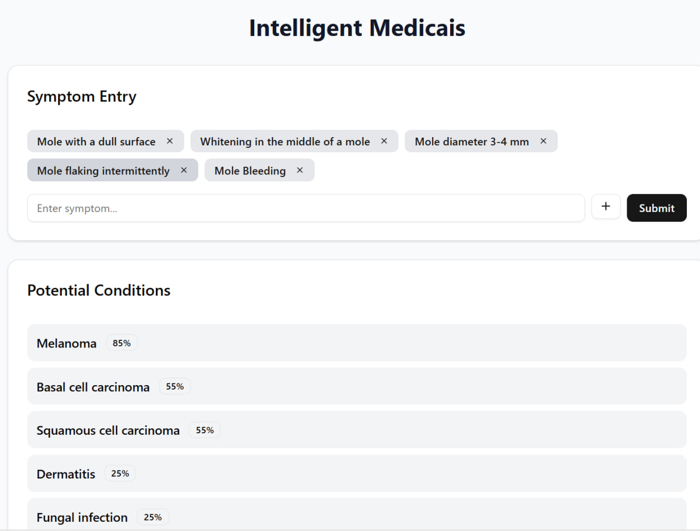
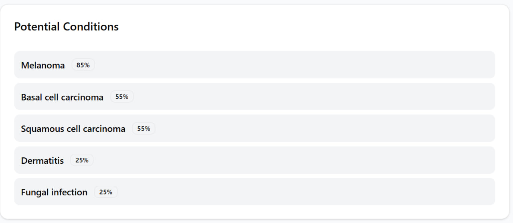
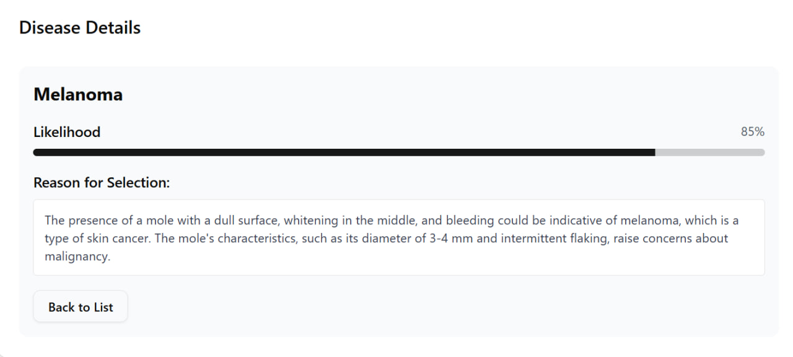
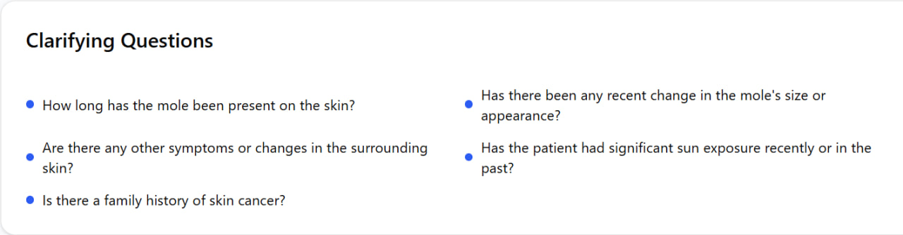

# 🧠 LLM-based Disease Diagnosis System using Prompt Engineering

This project designs a **lightweight medical assistant** using **Meerkat-7B**, a 7B-parameter open medical LLM,
to provide efficient and explainable disease diagnosis (privacy-preserving).

---

## 🚀 Features
- 🩺 Disease diagnosis based on patient symptoms
- 🧩 Prompt engineering techniques:
  - Zero-Shot Prompting  
  - Single-Step Chain-of-Thought  
  - Least-to-Most Prompting
- 📊 Evaluation metrics: Top-1 / Top-3 / Top-5 accuracy
- ⚙️ Lightweight model: Runs on local hardware (Quantized Meerkat-7B)
- 🔒 Privacy preserved – no external API calls

---

### 📸 UI Screenshots

| Interface Section | Preview |
|-------------------|----------|
| **Symptom Entry & Conditions** |  |
| **Potential Conditions List** |  |
| **Disease Details (Melanoma Example)** |  |
| **Clarifying Questions Section** |  |

---

## 🧬 Technologies
- Python, PyTorch, Hugging Face Transformers  
- Prompt Engineering, LLM Reasoning  
- Dataset: [DxBench](https://huggingface.co/datasets/FreedomIntelligence/DxBench)

---

## 📊 Results

### 🧠 Overall Model Comparison

| Model | Top-1 (%) | Top-3 (%) | Top-5 (%) |
|--------|-----------|-----------|-----------|
| GPT-4o | 32 | 50 | 63 |
| Meerkat-7B (FP16) | 33 | 53 | 56 |
| Meerkat-7B (Quantized) | 29 | 52 | 55 |

> **Dataset size:** 115 samples  
> **Description:** Overall accuracy comparison of GPT-4o and Meerkat-7B models (FP16 and Quantized) based on Top-1, Top-3, and Top-5 metrics.

### 🧪 Meerkat-7B (FP16) — Prompting Methods Comparison

| Method | Top-1 (Count / %) | In-List (Top-3) (Count / %) |
|--------|--------------------|-----------------------------|
| Zero-Shot | 29 / 25.2% | 63 / 54.8% |
| Single-Step CoT | 38 / 33.0% | 66 / 57.4% |
| Least-to-Most | 24 / 20.9% | 54 / 47.0% |

> **Dataset size:** 115 samples  
> **Description:** Comparison of three prompting strategies (Zero-Shot, Single-Step CoT, Least-to-Most) using the Meerkat-7B (FP16) model.

### 🤖 GPT-4o — Prompting Methods Comparison

| Method | Top-1 (Count / %) | In-List (Top-3) (Count / %) |
|---------|--------------------|------------------------------|
| Zero-Shot | 39 / 33.9% | 67 / 58.3% |
| Single-Step CoT | 33 / 28.7% | 61 / 53.0% |
| Least-to-Most | 34 / 29.6% | 51 / 44.4% |

> **Dataset size:** 115 samples  
> **Description:** Comparison of three prompting strategies (Zero-Shot, Single-Step CoT, Least-to-Most) using the GPT-4o model.

### ⚙️ Meerkat-7B (4-bit Quantized) — Prompting Methods Comparison

| Method | Top-1 (Count / %) | In-List (Top-3) (Count / %) |
|---------|--------------------|------------------------------|
| Zero-Shot | 27 / 23.7% | 60 / 52.1% |
| Single-Step CoT | 33 / 28.7% | 61 / 53.0% |
| Least-to-Most | 25 / 21.7% | 51 / 44.4% |

> **Dataset size:** 115 samples  
> **Description:** Comparison of three prompting strategies (Zero-Shot, Single-Step CoT, Least-to-Most) using the Meerkat-7B (4-bit Quantized) model.

### 📊 Overall Performance Comparison — GPT-4o vs Meerkat-7B (Full Dataset)

| Metric | Meerkat-7B (CoT) — Count / % | GPT-4o (Zero-Shot) — Count / % |
|---------|------------------------------|--------------------------------|
| Top-1 | 356 / 31.0% | 339 / 30.0% |
| Top-3 | 621 / 54.0% | 569 / 50.0% |
| Top-5 | 677 / 59.0% | 690 / 60.0% |

> **Dataset size:** 1148 samples  
> **Description:** Overall diagnostic performance comparison between Meerkat-7B (Chain-of-Thought prompting) and GPT-4o (Zero-Shot prompting) across the full evaluation dataset.

### 🏥 Department-wise Performance — GPT-4o (Zero-Shot) vs Meerkat-7B (CoT)

| Department | Top-1 (%) GPT-4o | Top-1 (%) Meerkat | Top-3 (%) GPT-4o | Top-3 (%) Meerkat | Top-5 (%) GPT-4o | Top-5 (%) Meerkat |
|-------------|------------------|-------------------|------------------|-------------------|------------------|-------------------|
| Surgery | 30 | 19 | 46 | 40 | 56 | 52 |
| Obstetrics & Gynecology | 26 | 31 | 41 | 58 | 56 | 67 |
| Internal Medicine | 23 | 30 | 44 | 52 | 57 | 59 |
| Dentistry | 25 | 14 | 54 | 38 | 61 | 40 |
| Neurology | 38 | 43 | 54 | 57 | 61 | 61 |
| Oncology | 21 | 21 | 41 | 36 | 52 | 43 |
| Orthopedics | 33 | 28 | 53 | 54 | 58 | 55 |
| Pediatrics | 34 | 31 | 42 | 37 | 56 | 41 |
| Otorhinolaryngology | 30 | 27 | 50 | 56 | 62 | 61 |
| Reprod. & Men's Health | 19 | 21 | 34 | 41 | 48 | 42 |
| Dermatovenereology | 28 | 31 | 60 | 69 | 69 | 73 |
| Other | 20 | 38 | 32 | 63 | 56 | 69 |
| Psychology | 58 | 67 | 80 | 87 | 86 | 88 |
| Hematology | 25 | 29 | 54 | 48 | 58 | 50 |
| Infectious Diseases & Immunology | 26 | 30 | 48 | 59 | 52 | 67 |

> **Description:** Department-level Top-1, Top-3, and Top-5 accuracies comparing GPT-4o (Zero-Shot) and Meerkat-7B (CoT).  
> Values are rounded percentages based on 15 departments across the DxBench dataset.

### 🩺 Department-wise Top-1 Accuracy Comparison

| Department | GPT-4o (%) | Meerkat-7B (FP16) (%) | Meerkat-7B (Quantized) (%) |
|-------------|------------|------------------------|-----------------------------|
| Surgery | 22 | 22 | 11 |
| Obstetrics & Gynecology | 40 | 20 | 20 |
| Internal Medicine | 10 | 40 | 40 |
| Dentistry | 14 | 14 | 14 |
| Neurology | 38 | 25 | 25 |
| Oncology | 33 | 33 | 17 |
| Orthopedics | 33 | 33 | 33 |
| Pediatrics | 17 | 17 | 50 |
| Otorhinolaryngology | 50 | 12 | 12 |
| Reproductive & Men’s Health | 43 | 57 | 57 |
| Dermatovenereology | 50 | 42 | 33 |
| Other | 14 | 29 | 29 |
| Psychology | 50 | 62 | 62 |
| Hematology | 20 | 40 | 0 |
| Infectious Diseases & Immunology | 33 | 67 | 0 |

> **Description:** Department-level Top-1 accuracy comparison between GPT-4o, Meerkat-7B (FP16), and Meerkat-7B (4-bit Quantized) models.

### ⏱️ Inference Time Summary — Meerkat-7B Models

| Metric | Meerkat-7B (Single-Step CoT) | Meerkat-7B (Quantized) |
|---------|------------------------------|-------------------------|
| Number of Samples | 1148 | 115 |
| Mean | 45.10 | 47.93 |
| Median | 44.13 | 47.10 |
| Minimum | 18.41 | 31.47 |
| Maximum | 119.22 | 81.89 |
| P90 | 55.55 | 59.59 |
| P95 | 60.02 | 64.84 |
| P99 | 72.01 | 72.38 |

> **Units:** seconds (s)  
> **Description:** Statistical summary of inference times for Meerkat-7B under two configurations — 4-bit Quantized and Single-Step CoT precision.

---

## 📂 Project Files Description

| File / Folder | Description |
|----------------|-------------|
| **medical-ai-chatbot-front.zip** | Frontend code (Next.js). In `page.tsx`, set the variable `API_URL` to your NGROK URL. |
| **Medical_Assistant-final.ipynb** | Main backend notebook (server side). Loads Meerkat-7B (float16). Uses `NGROK_AUTH_TOKEN` to connect frontend ↔ backend on Google Colab. Handles input parsing, reasoning extraction, and response formatting. |
| **Meerkat_Model.ipynb** | Loads Meerkat-7B (float16), cleans DxBench dataset, and tests on full dataset using 3 prompting techniques (Zero-Shot, CoT, Least-to-Most). Saves model outputs and creates a *judge* file for GPT-5 evaluation. |
| **bnb_4bit_smash_Meerkat_Model.ipynb** | Loads quantized (4-bit) Meerkat-7B, runs tests on selected samples, saves outputs and *judge* files for GPT-5. Optimized for low-resource inference. |
| **GPT_4o_test_creating_prompts.ipynb** | Generates prompt formats for testing GPT-4o as a comparison model. Outputs are later used by API scripts for evaluation. |
| **test-api-final.py** | Script for sending model outputs to **Metis API (GPT-5 Judge)**. Requires `api_key` and `bot_id`. Takes `verify` files from previous notebooks, sends them to GPT-5, and saves JSONL responses. |
| **generate.py** | Runs GPT-4o (via API) using prompts generated earlier and stores outputs, which are later evaluated by GPT-5 Judge via `test-api-final.py`. |
| **dep-analyze.py** | Analyzes the GPT-5 JSONL results to compute Top-1 / Top-3 / Top-5 accuracy and per-department performance. Adjust input/output paths before running. |

---

## 🧠 Notes
- Run notebooks on **Google Colab**.
- Always execute `!pip install -U datasets` and then **Restart Runtime** before running cells.
- Keep NGROK active during frontend-backend connection testing.
